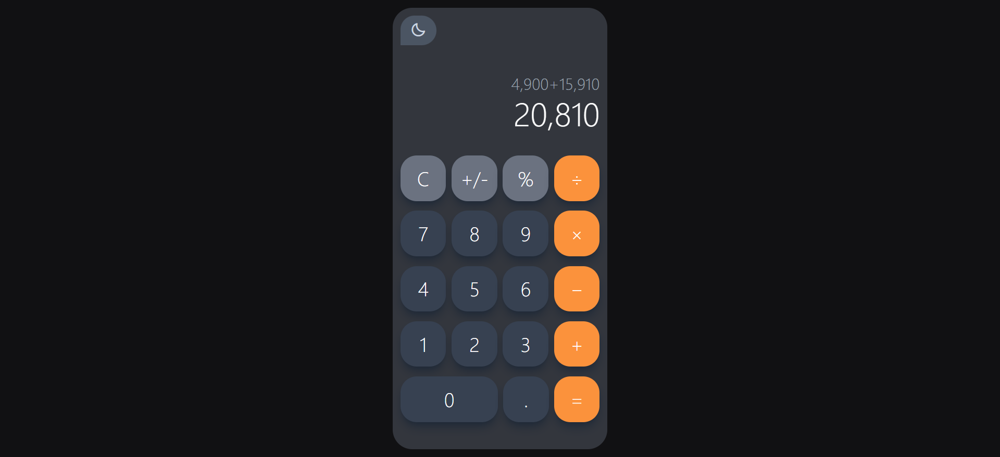
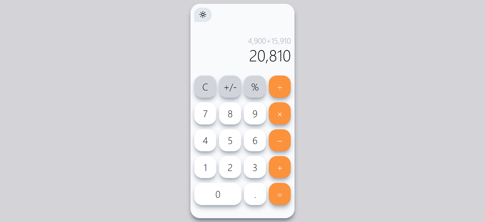

# Calculator Project

A responsive and user-friendly calculator application built with HTML, CSS (using Tailwind CSS), and JavaScript. This calculator provides basic and advanced functions, allowing users to perform quick and accurate calculations on any device.

## Features

- Basic arithmetic operations: addition, subtraction, multiplication, and division.
- Percentage calculations.
- Unary operations: clear (C) and change sign (+/-).
- Responsive design that works on various screen sizes.
- Dark mode toggle for improved usability in low-light conditions.
- User-friendly interface with a clear display of current calculations and history.

## Technologies Used

- **HTML**: Structure of the web application.
- **Tailwind Css**: Styling using [Tailwind CSS](https://tailwindcss.com/).
- **JavaScript**: Interactivity and logic for calculations.
- **Boxicons**: Icons for UI elements.

## Preview

## Live Demo 
[https://naglaa99.github.io/calculator/]